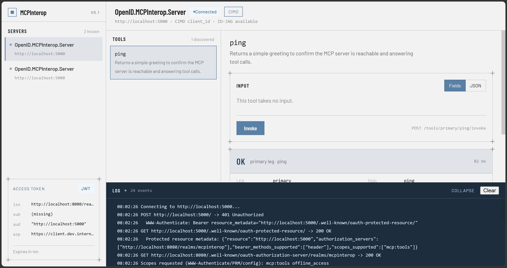

# OpenID.MCPInterop

A .NET test harness for the OpenID Foundation's [MCP-Based AI Agent Security
with Open Identity Standards](https://openid.net/call-for-participation-demonstrate-mcp-based-ai-agent-security-with-open-identity-standards-2/)
interop event, culminating at the Gartner IAM Summit (December 2026).

Built with the official [MCP C# SDK](https://github.com/modelcontextprotocol/csharp-sdk),
Keycloak (CIMD), and a local stand-in ID-JAG issuer for the EMA/cross-org
flow. See [`docs/architecture.md`](docs/architecture.md) for how the pieces
map to the interop event's reference architecture, and for the recommended
build order.

## Solution layout

```
OpenID.MCPInterop.sln
├── src/
│   ├── OpenID.MCPInterop.Common/    Shared models & constants (CIMD doc, ID-JAG claims, grant types)
│   ├── OpenID.MCPInterop.Client/    MCP client - CIMD + EMA test harness
│   ├── OpenID.MCPInterop.Server/    MCP server - Agent Governance target
│   └── OpenID.MCPInterop.Issuer/    Stand-in enterprise IdP - mints ID-JAGs for local testing
├── tests/
│   ├── OpenID.MCPInterop.UnitTests/
│   └── OpenID.MCPInterop.IntegrationTests/
├── deploy/
│   ├── keycloak/           Local Keycloak (CIMD leg) - see docs/keycloak-setup.md
│   └── aspire-dashboard/   Standalone OTEL viewer - see docs/observability.md
└── docs/
    ├── architecture.md
    ├── keycloak-setup.md
    ├── observability.md
    └── MCP_client.png       Screenshot of the Client test harness UI
```

## The Client test harness

`OpenID.MCPInterop.Client` is a browser-driven MCP client: a small web UI
with a **Connect** button and a human-readable session log that walks each
OAuth step as it happens (authorization redirect, token exchange, tool
call), rather than an auto-run console app. It's config-driven across named
scenarios (`--launch-profile` / `ASPNETCORE_ENVIRONMENT`), so the same UI
drives the CIMD Agent Governance leg against this repo's Keycloak
(`Keycloak`), the direct-trust Leg 3 flow (`11AIBlockchain`), the CIMD leg
presenting a document published to GitHub Pages instead of one it hosts
itself (`GitHubPages`), or that same published document against a live
third-party participant (`jshe`, Descope + an external MCP server); the
EMA / ID-JAG cross-org leg is a further opt-in on the `Keycloak` scenario.
The log pane can be resized by drag and copied to the clipboard for
pasting into interop bug reports.

```bash
dotnet run --project src/OpenID.MCPInterop.Client --launch-profile Keycloak
```



## Getting started

Requires the [.NET 10 SDK](https://dotnet.microsoft.com/download) or later
(the `TargetFramework` in each `.csproj` can be bumped if you're on a newer
SDK). Package versions were current as of this scaffold's creation - the MCP
C# SDK ships fast, so run `dotnet restore` and check for newer stable
versions before you start building on top of this.

```bash
git clone <this-repo-url>
cd OpenID.MCPInterop
dotnet restore
dotnet build
```

Then follow the setup order in [`docs/architecture.md`](docs/architecture.md).

## Contributing / testing against this

If you're another participant in the interop event, you're welcome to point
your own client or authorization server at the pieces here - see "For other
interop participants" in [`docs/architecture.md`](docs/architecture.md) for
specifics. Issues and PRs welcome, especially anything surfacing a
claim-shape or discovery-metadata mismatch - that's the whole point of the
exercise.

## License

Licensed under the [Apache License, Version 2.0](LICENSE) - other interop
participants are free to test against, fork, or reuse anything here.

## Related reading

- [OpenID Foundation call for participation](https://openid.net/call-for-participation-demonstrate-mcp-based-ai-agent-security-with-open-identity-standards-2/)
- [Identity Assertion Authorization Grant (ID-JAG) draft](https://www.ietf.org/archive/id/draft-parecki-oauth-identity-assertion-authz-grant-05.html)
- [CIMD draft](https://datatracker.ietf.org/doc/draft-ietf-oauth-client-id-metadata-document/)
- [Microsoft's app-service-ema-mcp reference lab](https://github.com/seligj95/app-service-ema-mcp)
- [xaa.dev sandbox](https://xaa.dev)
