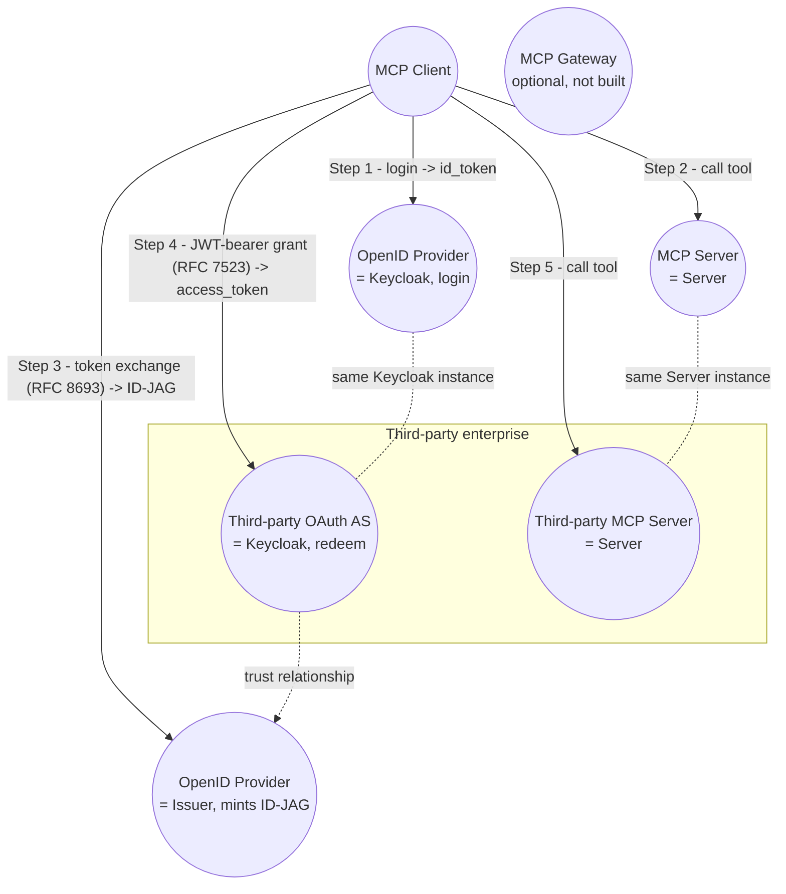
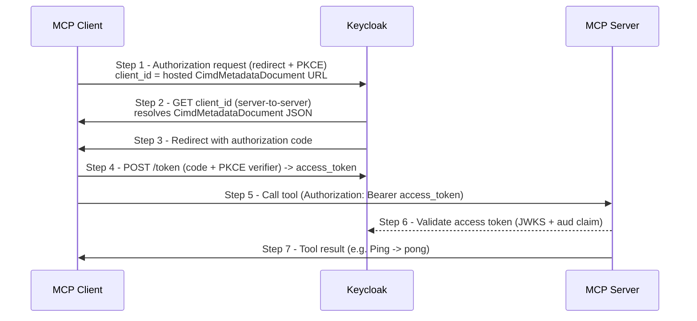
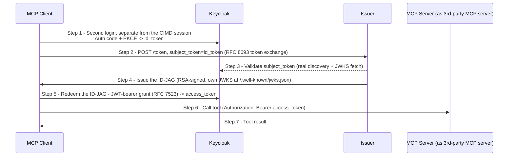
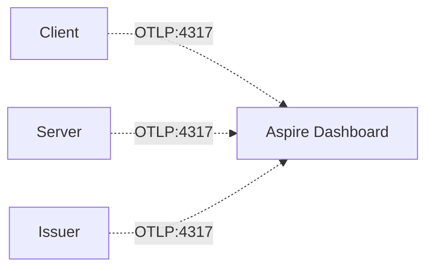

# Architecture

This solution is a personal test harness for the OpenID Foundation's
"Demonstrate MCP-Based AI Agent Security with Open Identity Standards"
interop event. It maps to the "Interop Test Architecture" diagram as follows:

| Diagram element | This repo |
|---|---|
| MCP Client | `src/OpenID.MCPInterop.Client` |
| MCP Server | `src/OpenID.MCPInterop.Server` |
| OpenID Provider (login, arrow 1 - issues the subject `id_token`) | Keycloak - a second, dedicated auth-code+PKCE login, separate from the CIMD leg's own |
| OpenID Provider (issues ID-JAG, step 3) | `src/OpenID.MCPInterop.Issuer` (local stand-in) or Okta/a partner IdP |
| Third-party OAuth AS (redeems ID-JAG, step 4) | Keycloak again (external, `identity-assertion-jwt` feature) |
| Third-party MCP Server (step 5) | A partner's server, or a second instance of `Server` |
| MCP Gateway (optional) | Not built yet - out of scope for the first milestone |

The reference diagram draws the OpenID Provider as one circle. This repo
splits that role across two systems - Keycloak issues the subject `id_token`
(arrow 1), `Issuer` mints the ID-JAG from it (arrow 3) - because no
mainstream open-source IdP issues ID-JAGs yet, which is the gap `Issuer`
exists to fill (see "For other interop participants" below). Keycloak and
`Server` also each appear under two different generic role names in the
reference diagram; both are the same running instance both times, just a
different client registration (Keycloak) or a different logical caller
(`Server`):

### Picking and choosing services

Implementers who already have their own OAuth AS and/or OpenID Provider
don't have to run this repo's Keycloak/`Issuer` to use `Client`/`Server` -
how much is config-only depends on which piece:

- **`Server`** is a plain `JwtBearer` resource server (`Authorization:Authority`/
  `Audience`/`RequireHttpsMetadata` in its `appsettings.json`) - nothing
  Keycloak-specific in code. Point it at any standard OIDC-compliant AS.
- **`Client`'s CIMD leg** (arrow 2) is config-driven too (`Client:CimdDocumentUrl`/
  `RedirectUri`/`Scopes`, `Server:Endpoint`), but only works against an AS
  that implements CIMD (draft-ietf-oauth-client-id-metadata-document) -
  a protocol capability, not just a URL.
- **`Client`'s EMA leg** has two independent settings under `Ema:` -
  `IdentityProviderAuthority` (arrow 1's login IdP) and `ResourceAuthority`
  (arrow 4's redemption AS). Point them at two different systems if your
  OpenID Provider and OAuth AS genuinely aren't the same product; the
  resource AS still needs to support the RFC 7523 JWT-bearer grant for an
  externally-issued assertion (Keycloak's `identity-assertion-jwt` preview
  feature does this; not every AS does yet).
- **`Issuer`** mirrors that split via `Issuer:IdentityProviderAuthority`
  (validates the subject `id_token`) and `Issuer:ResourceAuthority` (the
  ID-JAG's `aud` claim) - or skip `Issuer` entirely and point `Client`'s
  `Ema:IssuerUrl` at your own ID-JAG-minting IdP, since `Client` only expects
  RFC 8693 semantics at `/token`.

## Service flow diagrams

Two independent legs share one Keycloak realm. The Agent Governance leg
(CIMD) is fully self-contained between `Client` and `Server`; the cross-org
leg (EMA) routes through `Issuer` to mint an ID-JAG before Keycloak will
redeem it. Both legs, plus `Issuer`, stream telemetry to a standalone Aspire
Dashboard the whole time - a dev-only side channel, not part of either
protocol flow (see [`docs/observability.md`](observability.md)).

### Leg 1 - Agent Governance (CIMD)

### Leg 2 - Cross-org (EMA / ID-JAG)

### Observability - dev-only side channel

Container roles worth calling out explicitly:

- **Keycloak** plays a dual role across the two legs: OAuth AS for the CIMD
  leg (validates the CIMD-registered client, issues the access token
  `Server` checks), *and* the id_token issuer plus third-party OAuth AS for
  the EMA leg (mints the subject `id_token`, then separately redeems the
  ID-JAG via the RFC 7523 JWT-bearer grant) - same realm, different client
  registrations, not two different servers.
- **Aspire Dashboard** is the standalone OTLP sink/UI only - not the full
  .NET Aspire AppHost/ServiceDefaults orchestration model. `Client`,
  `Server`, and `Issuer` each export traces, metrics, and structured logs to
  it over OTLP/gRPC on `:4317`, distinguished by the Resource
  column/filter (their `service.name`) rather than a dedicated "Resources"
  page. It's dev-only and never sees request/response bodies, since those
  routinely carry bearer tokens.

## Two use cases, two build phases

**Agent Governance (diagram steps 1-2)** - CIMD-based OAuth 2.1 between
`Client` and `Server`, authorized by Keycloak. Fully self-contained, no
external partner required. Build and validate this first.

**Cross-org / EMA (diagram steps 3-5)** - `Client` requests an ID-JAG from
`Issuer` (RFC 8693 token exchange), redeems it at a resource AS (RFC 7523 JWT
bearer grant), then calls the target MCP server. Requires a resource AS that
can *receive* an ID-JAG (Keycloak's `identity-assertion-jwt` preview feature
works for this) since `Issuer` only fills the *issuing* side, which is the
gap in most open-source IdPs today. Implemented - see "EMA leg wiring" below
for how the pieces fit together, and
[`docs/keycloak-setup.md`](keycloak-setup.md)'s EMA section for the Keycloak
side.

### EMA leg wiring

Unlike the diagram's literal single "OpenID Provider" circle, this repo
splits that role across two systems rather than giving `Issuer` its own
interactive login:

- **Keycloak** (the same realm as the CIMD leg, different client
  registrations) plays "arrow 1" - `Client` runs a second, dedicated
  authorization-code+PKCE login against it (`/ema-callback`) purely to get a
  subject `id_token`. This is deliberately separate from the CIMD leg's own
  login, whose granted scope is resource-driven and isn't guaranteed to
  include `openid`.
- **`Issuer`** plays steps 3-4's token-exchange role only: `Client` presents
  that Keycloak-issued `id_token` as `subject_token` to `Issuer`'s `/token`
  (RFC 8693), which validates it against Keycloak's real discovery/JWKS and
  mints an ID-JAG signed with `Issuer`'s own RSA key, published at
  `/.well-known/jwks.json`.
- `Client` redeems the ID-JAG at Keycloak via the MCP SDK's
  `IdentityAssertionGrantProvider` (RFC 7523 JWT bearer grant, Keycloak's
  `identity-assertion-jwt` feature), authenticating as a pre-registered
  confidential client, then calls the target MCP server (here, the same
  `Server` instance, playing the "third-party MCP server" role) with the
  resulting bearer token.
- A consequence worth knowing: the ID-JAG's `sub` claim is copied straight
  from the Keycloak-issued `id_token` it was exchanged for - i.e. it's
  `testuser`'s own Keycloak-internal user ID. For Keycloak to accept the
  JWT-bearer redemption, it needs a `federatedIdentities` entry linking
  `testuser` back to that same ID under the `mcpinterop-issuer` identity
  provider alias - already wired into
  `deploy/keycloak/import/mcpinterop-realm.json` (pins `testuser`'s `id` so
  the link target is known ahead of time), but worth understanding if you
  add a second test user.

## Setup order

1. `xaa.dev` sandbox - watch a full ID-JAG flow with zero setup, before
   writing any code.
2. Bring up `Server` with no auth. Confirm `Client` can call its tools.
3. Stand up Keycloak locally with `--features=cimd` - run
   `.\deploy\keycloak\setup.sh`, which auto-imports the realm, CIMD client
   policy, and audience-mapper workaround from a known-working
   configuration; see [`docs/keycloak-setup.md`](keycloak-setup.md) for
   details and the manual fallback. `Client` already hosts its
   `CimdMetadataDocument` (see `Common/Models` and
   `Client/CimdDocumentFactory.cs`) and drives a full CIMD authorization
   code + PKCE flow against `Server` via the MCP C# SDK's built-in
   `ClientOAuthOptions`. **This is the Agent Governance milestone** - run
   `Server` then `Client` per `docs/keycloak-setup.md`'s "Quick start" to
   confirm it.
4. Bring up `Issuer` - its `/token` endpoint mints ID-JAGs (RSA-signed,
   published at `/.well-known/jwks.json`).
5. Keycloak's `identity-assertion-jwt` feature trusts `Issuer` as an ID-JAG
   source (issuer URL, JWKS, audience) - see
   [`docs/keycloak-setup.md`](keycloak-setup.md)'s EMA section; imported
   automatically by `deploy/keycloak/import/mcpinterop-realm.json`, same as
   the CIMD leg's config.
6. `Client` runs the EMA leg after the CIMD leg's `Ping` succeeds - two
   distinct browser logins in one run. **This is the cross-org milestone.**
   Confirmed working end-to-end against a live Keycloak instance - see
   [`docs/keycloak-setup.md`](keycloak-setup.md)'s EMA section for the real
   gotchas hit getting there (container networking, RFC 8693's
   `resource`/`audience` split, Keycloak's JWKS caching vs. `Issuer`'s
   ephemeral signing key) and how each was fixed.

## For other interop participants

- Point your own MCP client at `Server`'s endpoint to test the Agent
  Governance (CIMD) leg against a real implementation.
- Point your own resource AS at `Issuer`'s `/token` endpoint to test
  consuming an externally-issued ID-JAG - `/.well-known/openid-configuration`
  and `/.well-known/jwks.json` are both published for discovery.
- Open an issue or PR if you hit a claim-shape mismatch - that's exactly the
  kind of gap this event exists to surface.

Known rough edges to budget time for - most are about running this repo's
own local Keycloak/dev setup, but the `Issuer` ones (ID-JAG issuance gap,
ephemeral signing key) matter directly if you're consuming `Issuer` or
`Server` from outside this repo:

- No mainstream open-source IdP issues ID-JAGs out of the box yet (Keycloak,
  Ory Hydra, Entra ID all currently receive-only or unsupported). `Issuer` in
  this repo exists specifically to fill that gap for local testing, modeled
  on the pattern in Microsoft's `seligj95/app-service-ema-mcp` reference lab.
- `Issuer` generates an RSA key pair fresh in memory on every run (no
  persistence across restarts) and publishes the public half at
  `/.well-known/jwks.json` - don't cache its JWKS by `kid` across restarts,
  refetch on signature-validation failure the way you would for a real
  enterprise IdP.
- Keycloak's `identity-assertion-jwt` feature is explicitly marked
  experimental/preview in its own docs ("may introduce breaking changes...
  do not use in production") - budget time for this leg's Keycloak
  configuration to need real-instance iteration, the same as the CIMD leg's
  client policy did.
- Keycloak CIMD discovery may not yet advertise `"none"` in
  `token_endpoint_auth_methods_supported` - some clients require this to
  select CIMD over dynamic client registration.
- Keycloak doesn't support RFC 8707 resource indicators yet, so a CIMD
  client's access token won't carry the `aud` claim `Server` validates
  unless you add a client-scope audience mapper and `Client` requests that
  scope - see "What's imported automatically" in
  [`docs/keycloak-setup.md`](keycloak-setup.md) (this is now handled by the
  realm import, not a manual step, for this repo's own Keycloak).
- If Keycloak runs in a container, it has to fetch `Client`'s hosted CIMD
  document server-to-server - `localhost` in that URL would resolve to the
  Keycloak container, not the host machine running `Client`.
  `host.docker.internal` handles this on Docker Desktop, but is confirmed
  **unreliable on Podman with `podman machine` on Windows** for reaching
  arbitrary host ports (not a firewall issue - Podman's gvproxy network
  proxy itself). `deploy/keycloak/setup.sh` routes around it by generating
  a compose override that points a cert-compatible hostname straight at
  the host's real LAN IP - see `docs/keycloak-setup.md`'s "Podman on
  Windows..." section for the full story and how to keep it in sync if
  your LAN IP changes.
- The MCP SDK rejects a non-HTTPS `ClientMetadataDocumentUri`, so `Client`
  serves its CIMD document over HTTPS using the ASP.NET Core dev cert.
  Trusting that cert in Windows (for your browser) and in Keycloak's Java
  truststore (`--truststore-paths`, for its own server-to-server fetch) are
  two separate steps, both handled by `deploy/keycloak/setup.sh` - see
  `docs/keycloak-setup.md`'s "Quick start".
